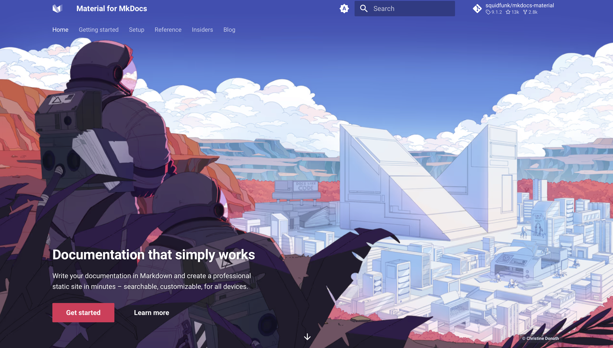
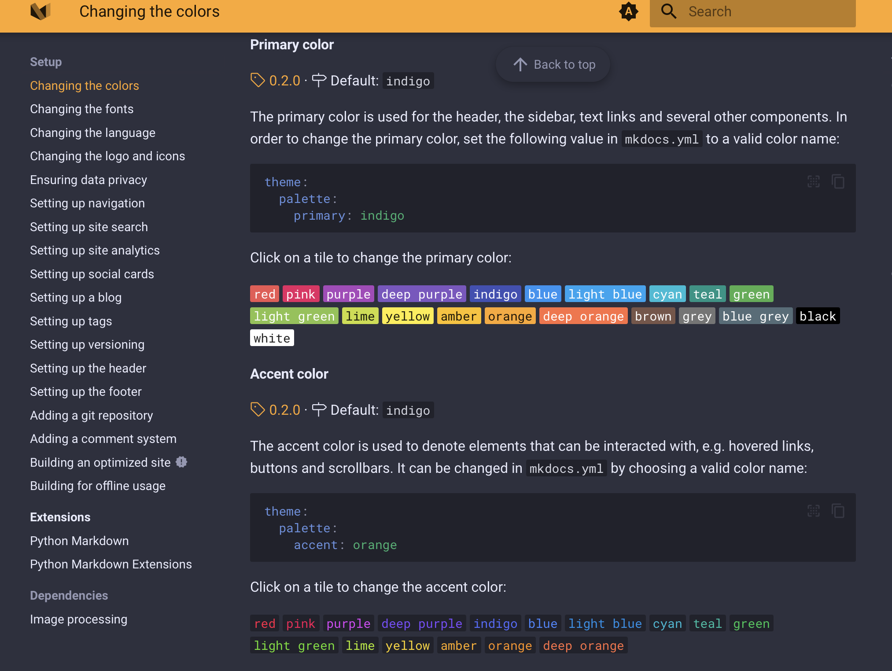
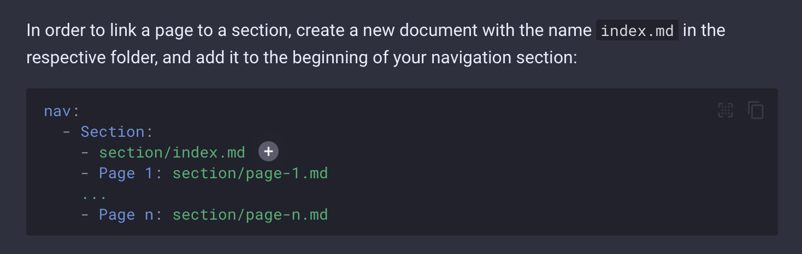

# My MkDocs Repository

This is my repository for building documentation using MkDocs, a fast and simple static site generator for building project documentation. The documentation is built using the Material for MkDocs theme, which provides a modern and responsive design, a customizable color scheme, and a range of useful features.

This is my repository for building documentation using [MkDocs](https://www.mkdocs.org/), a fast and simple static site generator for building project documentation. The documentation is built using the [Material for MkDocs](https://squidfunk.github.io/mkdocs-material/) theme, which provides a modern and responsive design, a customizable color scheme, and a range of useful features.

## Getting Started

To get started with MkDocs, you will need to have Python and pipenv installed on your system. You can then install MkDocs using pipenv, the Python package manager:

```sh
pipenv install mkdocs
```

## Building and Serving the Documentation

Once you have created your MkDocs project and configured the theme, you can build the documentation by running the mkdocs build command:

```sh
pipenv run build
```
This will build the documentation and create a site directory with the HTML, CSS, and JavaScript files for your site.

You can then serve the documentation using the mkdocs serve command:

```sh
pipenv run serve
```
This will start a local web server and open your documentation in your default web browser.

## Contributing

If you would like to contribute to this project, please fork the repository and submit a pull request. We welcome contributions of all kinds, including bug reports, feature requests, and code improvements.

## References

[MkDocs documentation](https://www.mkdocs.org/)
[Material for MkDocs documentation](https://squidfunk.github.io/mkdocs-material/)
[MkDocs on GitHub](https://github.com/mkdocs/mkdocs)
[Material for MkDocs on GitHub](https://github.com/squidfunk/mkdocs-material)

## Screenshots

Here are some screenshots of the Material theme in action:






